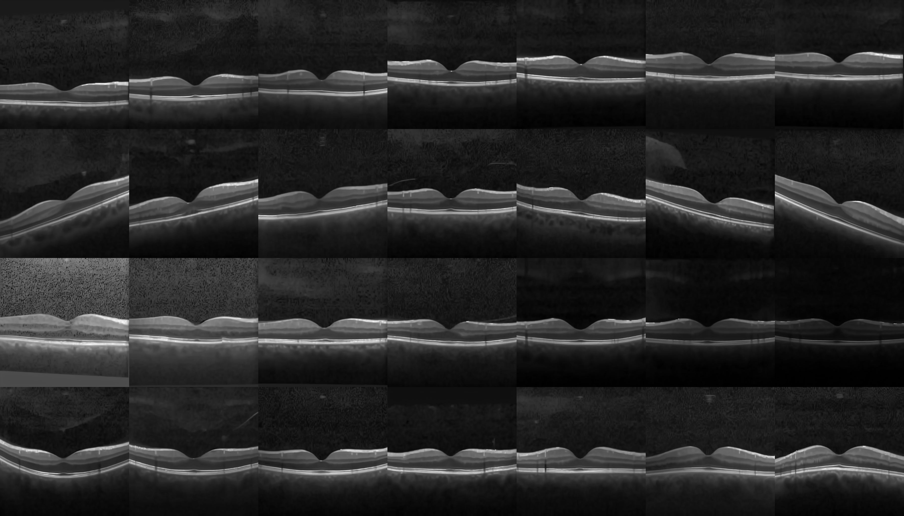
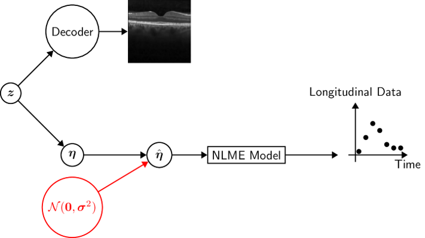

# Bridging Medical Images and Longitudinal Data
1.1M OCT images generated by a fine-tuned Stable Diffusion model with corresponding longitudinal data can be found here: https://doi.org/10.57967/hf/2089

This repository contains the code for how the data was created.

A notebook showcasing the Stable Diffusion model is located under src/use_SD_model.ipynb

