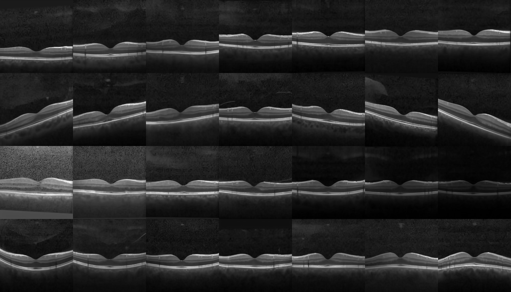
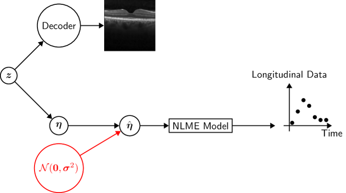

# Bridging Medical Images and Longitudinal Data

## Overview
This repository houses the code and resources for generating synthetic Optical Coherence Tomography (OCT) images and associated longitudinal data. Our approach utilizes a hybrid model integrating Variational Autoencoder (VAE), Stable Diffusion (SD), and Nonlinear Mixed-Effects (NLME) models to create an advanced synthetic dataset. This allows for controlled studies of predictive models in healthcare without compromising data privacy.

### Main Components
- **VAE Model**: Learns a structured latent space from a large public OCT dataset.
- **Stable Diffusion Model**: Generates high-quality synthetic OCT images conditioned on the latent space.
- **NLME Model**: Produces synthetic longitudinal data corresponding to the generated images.

## Resources
- **Dataset and Models**: Access the full dataset of 1.1 million images paired with synthetic longitudinal data and pre-trained models on our [Hugging Face page](https://doi.org/10.57967/hf/2089).

## Repository Structure
```plaintext
Image-Longitudinal/
│
├── src/                        # Source code for all models
│   ├── VAE/                    # Variational Autoencoder model files
│   │   ├── train_model.jl      # Script to train the VAE model
│   │   ├── VAE.jl              # VAE model definition
│   │   └──...
│   │
│   ├── Stable_Diffusion/       # Stable Diffusion model files
│   │   ├── environment.yaml    # Conda environment for Python dependencies
│   │   ├── use_SD_model.ipynb  # Notebook to use the pretrained SD model
│   │   ├── train_script.sh     # Script to train the SD model
│   │   └── train_SD.py         # Script to train the SD model
│   │
│   └── NLME/                   # Nonlinear Mixed-Effects model files
│       ├── nlme_model.jl       # NLME model implementation
│       └── ...
│
├── data/                       # Put the data from our Hugging Face page here
├── saved_models/               # Put the saved models from our Hugging Face here
├── Manifest.toml               # Julia environment file
├── LICENSE                     # The license file
├── README.md                   # The project README file
│
└── .gitignore                  # Specifies intentionally untracked files to ignore
```
## Images and Demonstrations
Below are visual representations of our synthetic data generation process:

### Effect of Varying Latent Dimensions
This image shows a $4\times 7$ grid of synthetically generated OCT images demonstrating the effects of varying four distinct latent dimensions. The central column of images, used as a baseline for comparison, is generated by setting the selected latent dimensions to zero.


### Overview of Image and Longitudinal Data Generation
The following figure illustrates how both the images and longitudinal data are generated from the same latent space $\boldsymbol{z}$.


### Image Generation GIF
This GIF demonstrates the image generation process starting from complete noise, gradually denoising until a clear OCT image is obtained.


## Installation and Usage

To get started with the Image-Longitudinal Integration for Predictive Modeling project, follow these steps:

1. **Install Julia**: Ensure that you have Julia installed on your system. Visit the official Julia website (https://julialang.org) and download the appropriate version for your operating system. Follow the installation instructions provided on the website.

2. **Set up the Python Environment for Stable Diffusion**: Navigate to the `src/Stable_Diffusion` directory in the project repository. Open a terminal or command prompt and run the following command to create a new Python environment using the provided `environment.yaml` file:

   ```
   conda env create -f environment.yaml
   ```

   This will create a new Conda environment with all the necessary dependencies for running the Stable Diffusion model.

3. **Activate the Python Environment**: Before running the Stable Diffusion model, make sure to activate the newly created Python environment. Use the following command:

   ```
   conda activate your_environment_name
   ```

   Replace `your_environment_name` with the name of the environment specified in the `environment.yaml` file.

4. **Customize and Experiment**: Feel free to modify the provided scripts or create new ones to experiment with different configurations.


## Citation
If you use the resources or code from this repository in your research, please cite our NeurIPS submission:

```bibtex
@inproceedings{neurips_paper_id,
  title={Bridging Medical Images and Longitudinal Data},
  author={Deltadahl et al.},
  booktitle={NeurIPS},
  year={2024},
  url={https://doi.org/TODO}
}
```

## License
This project is licensed under the terms of the MIT license.

## Contact
For any questions or inquiries, please contact scfc3@cam.ac.uk.
